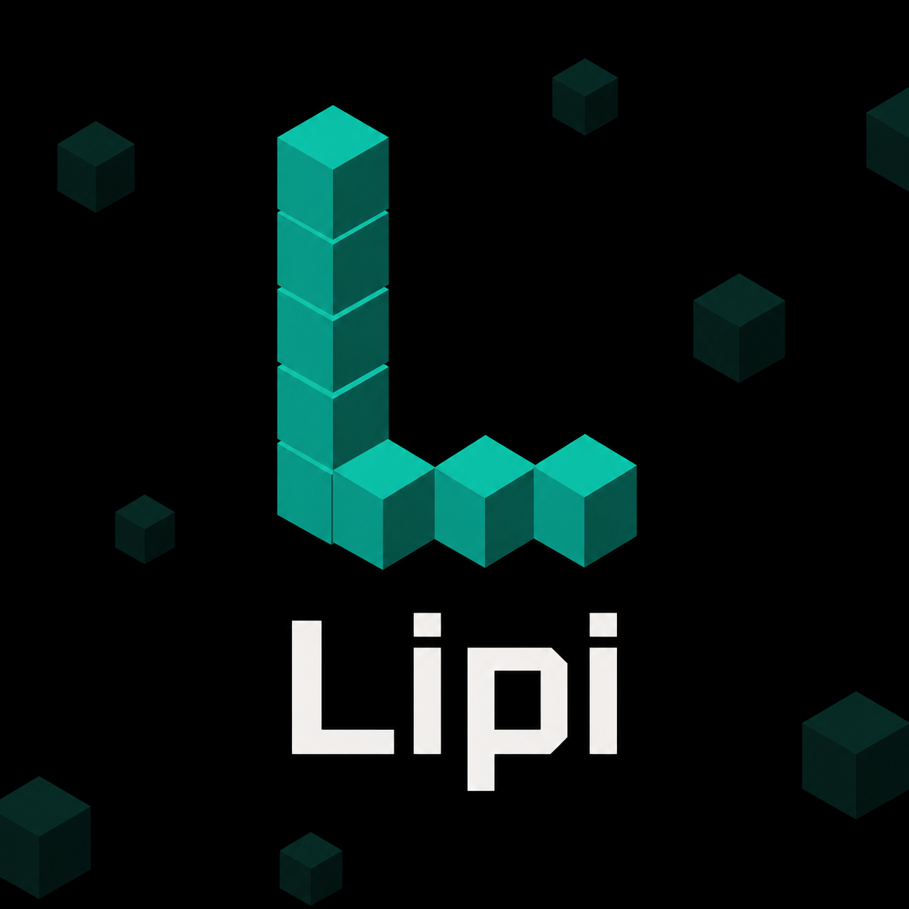

# Lipi

     [](https://github.com/sponsors/pun1th01)

**An independent, server-controlled chat platform for Fabric Minecraft servers.**

<p align="center">
  
</p>

---

## Why Lipi exists

Minecraft's default chat system is tied to Microsoft account verification requirements. Some players are unable to complete that verification, which leaves them locked out of chat on servers — even when the server owner wants them to participate.

Lipi adds an independent communication layer that the server owner fully controls. It runs completely alongside vanilla Minecraft chat without replacing or modifying it. Both Lipi chat and vanilla chat coexist — players can use either one freely.

Lipi is designed for small private SMPs and friend group servers where the owner wants full control over chat, logs, and moderation independent of Minecraft's default systems.

---

## Who is this for

- **Players whose Minecraft chat has been disabled** due to account verification requirements
- **Small SMP server owners** and friend groups running Fabric servers
- **Server owners** who want chat logging, moderation tools, and admin controls they fully control

**Not suitable for large public servers.** Lipi requires the mod installed on both client AND server, which makes it impractical for open servers with many unmodded players.

---

## Important limitation

Both the client **and** the server must have Lipi installed. Players without the mod cannot send or receive Lipi messages. They will see a notification that the server supports Lipi, but cannot participate until they install it.

This is by design, not a bug. Lipi uses custom network packets that both sides need to understand.

---

## Features

### Chat

- Independent Lipi chat channel alongside vanilla chat — messages use custom network packets, never touching the vanilla chat system
- Dedicated popup chat window — Lipi messages are displayed in their own window, not in vanilla chat
- Left sidebar with `# general` channel
- Messages show bold username + local `HH:MM` timestamp (player's own timezone)
- Scrollable message history with smart auto-scroll
- Chat history on join — last 20 messages sent before you connected (chat messages only, no join/leave events)

### Input

- **Right Shift** opens Lipi chat instantly
- Input immediately focused — type right away, no clicking needed
- **Enter** to send, **ESC** to close
- Command suggestions when typing `/` (same as vanilla chat)
- Run any Minecraft server command from the Lipi input field (e.g., `/gamemode creative`)

### HUD indicator

- Persistent **L** indicator visible on the right side of the screen during normal gameplay
- Unread message badge with count (red badge, caps at `9+`)
- Badge clears when you scroll to the bottom of messages in the Lipi window
- Only visible on servers with Lipi installed
- Hidden when the Lipi chat screen is open

### Server-side logging

- **Log location:** `config/lipi/logs/`
- **Log filename format:** `YYYY-MM-DD.log` (one file per day)
- **Log line format:**
  ```
  [2026-06-27 16:45:12] [GLOBAL] [player-uuid] PlayerName: message text
  [2026-06-27 16:45:12] [JOIN] [player-uuid] PlayerName joined Lipi
  [2026-06-27 16:45:12] [LEAVE] [player-uuid] PlayerName left Lipi
  ```
- **Retention:** controlled by `log-retention-days` config (default: 30 days)
- **To keep logs forever:** set `log-retention-days = 0` to disable auto-deletion

---

## How to use

### For server owners — Installation

1. Install [Fabric Loader](https://fabricmc.net/) for Minecraft 1.21.5
2. Download [Fabric API](https://modrinth.com/mod/fabric-api) for 1.21.5
3. Download `lipi-mc1.21.5-3.0.0.jar`
4. Place both jars in your server's `mods/` folder
5. Start the server — config generates automatically at `config/lipi-server.toml`
6. Op yourself if needed: `op <username>` in the server console

### For players — Installation

1. Install [Fabric Loader](https://fabricmc.net/) for Minecraft 1.21.5
2. Download [Fabric API](https://modrinth.com/mod/fabric-api) for 1.21.5
3. Download `lipi-mc1.21.5-3.0.0.jar`
4. Place both jars in your `.minecraft/mods/` folder
5. Join a server that has Lipi installed

### Daily usage

| Action | How |
|--------|-----|
| Open Lipi chat | Press **Right Shift** |
| Send a message | Type your message → **Enter** |
| Run a server command | `/gamemode creative` → **Enter** |
| Close Lipi chat | **ESC** |
| Read older messages | Scroll up in the Lipi window |
| Clear unread badge | Scroll back to the bottom of messages |

---

## Admin commands

| Command | Permission | Description |
|---------|------------|-------------|
| `/lipi mute <player>` | Operator (level 3) | Permanently mutes a player. Their Lipi messages are silently dropped server-side. |
| `/lipi mute <player> <duration>` | Operator (level 3) | Temporarily mutes a player. Duration format: `10s`, `5m`, `1h`, `1d`. |
| `/lipi unmute <player>` | Operator (level 3) | Removes the mute from a player. |
| `/lipi mutelist` | Operator (level 3) | Lists all currently muted players with expiry info (permanent or time remaining). |
| `/lipi toggle` | Operator (level 3) | Toggles Lipi on or off for the entire server. Updates the config file. |
| `/lipi log <player>` | Operator (level 3) | Displays the last 10 Lipi messages from that player in today's log. |

All admin commands require **operator level 3**.
Temp mutes auto-expire without manual intervention.

---

## Server configuration

### Server — `config/lipi-server.toml`

| Config key | Default | Description |
|------------|---------|-------------|
| `enabled` | `true` | Whether Lipi is active on the server. Can also be toggled at runtime with `/lipi toggle`. |
| `log-retention-days` | `30` | Number of days to retain log files. Set to `0` to disable auto-deletion. |
| `max-message-length` | `256` | Maximum allowed message length in characters. Messages longer than this are rejected. |
| `message-cooldown-seconds` | `0` | Per-player cooldown between messages in seconds. `0` = no cooldown. |
| `slow-mode-seconds` | `0` | Global slow mode: minimum gap between any two messages in seconds. `0` = disabled. |

Config file location: `config/lipi-server.toml`
Generated automatically on first server start.

### Client — `config/lipi-client.toml`

| Config key | Default | Description |
|------------|---------|-------------|
| `chat-background-opacity` | `0.5` | Alpha value for the Lipi chat window background. `0.0` = fully transparent, `1.0` = fully opaque. |

### Mute list — `config/lipi/muted-players.json`

Managed via `/lipi mute` and `/lipi unmute`. Stores muted player UUIDs with expiry timestamps. Manual edits require a server restart.

---

## Viewing server logs

Log files are stored on the server filesystem only. The mod developer has **zero access** to any data.

- **Log path:** `config/lipi/logs/`
- **Log filenames:** `YYYY-MM-DD.log` (one file per day)
- **Log line format:**
  ```
  [2026-06-27 16:45:12] [GLOBAL] [player-uuid] PlayerName: message text
  [2026-06-27 16:45:12] [JOIN] [player-uuid] PlayerName joined Lipi
  [2026-06-27 16:45:12] [LEAVE] [player-uuid] PlayerName left Lipi
  ```
- **To view logs:** open with any text editor (Notepad, VS Code, nano)
- **In-game log access:** `/lipi log <player>` shows that player's last 10 messages directly in chat
- **Retention:** controlled by the `log-retention-days` config key
- **To keep logs forever:** set `log-retention-days = 0`

---

## Data and privacy

- All data is stored on the server owner's filesystem
- The mod developer has no access to any user data
- Server operators are solely responsible for their own logs, moderation, and any applicable data policies
- Players can ask their server owner to view or delete their chat history

---

## Building from source

### Requirements

- JDK 21 or higher
- Gradle 8.14+

### Build

```bash
# Windows
.\gradlew.bat build

# Linux / macOS
./gradlew build
```

### Output

`build/libs/lipi-mc1.21.5-3.0.0.jar`

---

## Roadmap

### Alpha V3 (current)

- Dedicated Lipi chat window ✅
- Local timezone timestamps ✅
- Security hardening ✅
- Temp mute system ✅
- Anti-spam config ✅

### Beta V1 (planned)

- Multi-version support (1.21.1, 1.20.1)
- Multi-channel support
- Media and GIF sharing
- Improved moderation tools

### Long term

- Forge/NeoForge port
- A full in-game communication platform that makes external apps like Discord optional for small servers

---

## Contributing

- Open issues on [GitHub](https://github.com/pun1th01/Lipi) for bug reports
- PRs welcome
- Solo student project — active development ongoing
- College student building this in free time, development pace may vary during semester

---

## Support development

If Lipi is useful to your server, consider sponsoring:
**https://github.com/sponsors/pun1th01**

Solo student project with no funding or team. Any support helps keep development active through college.

---

## License

MIT License — see [LICENSE](https://github.com/pun1th01/Lipi/blob/main/LICENSE)

Copyright (c) 2026 Punith P.
